# Miradas — Pediatric Clinic ERP

A practice platform for a pediatric clinic in Argentina (Consultorios _Miradas_ — Dra. Patricia Martinangelio, Pueblo Esther, Santa Fe): appointments, clinical records, prescriptions, a patient portal and the clinic's public website. Built before the practice opened its doors, so the record starts out verifiable — not reconstructed after the fact.

Running in production: the clinic's site at [www.dramartinangelio.com](https://www.dramartinangelio.com) and the ERP at [app.dramartinangelio.com](https://app.dramartinangelio.com).

## The starting point

The practice was about to open. There were no patients yet, no legacy system to migrate and no habits to work around — which was exactly the design constraint: the clinical record, the schedule and the patient channel would either be foundations from day one, or the clinic would spend years patching over gaps.

- **Records that hold up from the first patient.** Argentina's Law 26.529 expects traceable clinical records. Instead of retrofitting that onto paper later, the data model enforces it: nothing is physically deleted, and every change is attributable.
- **Scheduling that doesn't need a phone call.** Office hours aren't fixed, so families check availability and request a slot on their own — and the practice gets a queue to confirm or cancel.
- **Privacy from the start.** The practice operates from a home address: the public site publishes only the city, and the exact location unlocks behind a registered account.
- **One screen per job.** Running the day, documenting a consultation and booking an appointment are different tasks; collapsing them into one interface would have served none of them well.

None of this is about adding features later — these are foundations, and the system was built around them before the first appointment.

## Approach

The design started from one constraint: **make the record verifiable without making the practitioner's day heavier.** That shaped the product decisions: scheduling lives in a portal families already understand, clinical data is append-only by default, and the workflow is split into surfaces that match how each role actually works — overseeing a schedule and running a consultation are not the same task.

- **Compliance in the data model, not in a policy.** Every entity carries a mandatory `deletedAt` (soft delete) and clinical writes land in an append-only `AuditLog` (Law 26.529). Nothing is physically deleted; every access is attributable.
- **Three surfaces, one product.** A staff dashboard for running the day, a patient portal for families, and a static public site for discovery and booking — same API, same design tokens.
- **Language per audience.** The same `REQUESTED` appointment reads "Solicitado" to staff and "Pendiente de confirmación" to families (`apps/web/app/portal/page.tsx`).
- **Security by default.** A global JWT guard plus role checks across 5 roles; public registration can only create patients; staff accounts are created by admins; rate limiting, Helmet/CSP, redacted logs and Zod-validated env — the API refuses to start misconfigured.
- **One contract across apps.** Shared Zod schemas (`packages/schemas`) drive both API validation and web forms, so contract drift breaks the build instead of production.
- **Sessions that can be revoked.** Every request re-validates the JWT subject against the database: a soft-deleted account's outstanding tokens stop working immediately.

## What it solves

- **Appointments without phone calls.** Families see availability and request a slot from the portal; requests land in a staff confirmation queue (`REQUESTED → SCHEDULED`).
- **Clinical history at the point of care.** The daily worklist opens patient context, latest evolutions and the prescription form without leaving the consultation screen.
- **Prescriptions as documents.** PDF prescriptions issued from the patient record, with the professional's data and license.
- **Auditable clinical data.** Append-only audit log, soft deletes and role-scoped access — answers "who did what, when".
- **Privacy with access.** The public site publishes the city; the exact address is visible only to logged-in families.

## Screens

_Screenshots use seeded demo data (`packages/db/prisma/seed.ts`) — no real patient information._

### Landing — desktop & mobile

The public site is an Astro build, zero JavaScript by default: content is server-rendered and only the interactive pieces (the fanned stage cards, the mobile menu) ship as React islands. The layout is composed per breakpoint — same content, different composition.

| Landing section                                                                                                                            |                                         Desktop (1440px)                                          |                                         Mobile (390px)                                          |
| :----------------------------------------------------------------------------------------------------------------------------------------- | :-----------------------------------------------------------------------------------------------: | :---------------------------------------------------------------------------------------------: |
| **Hero** — the practice's promise and the two entry points: book an appointment or enter the portal.                                       |     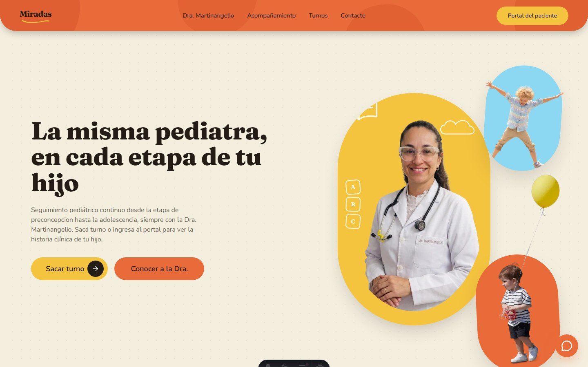     |     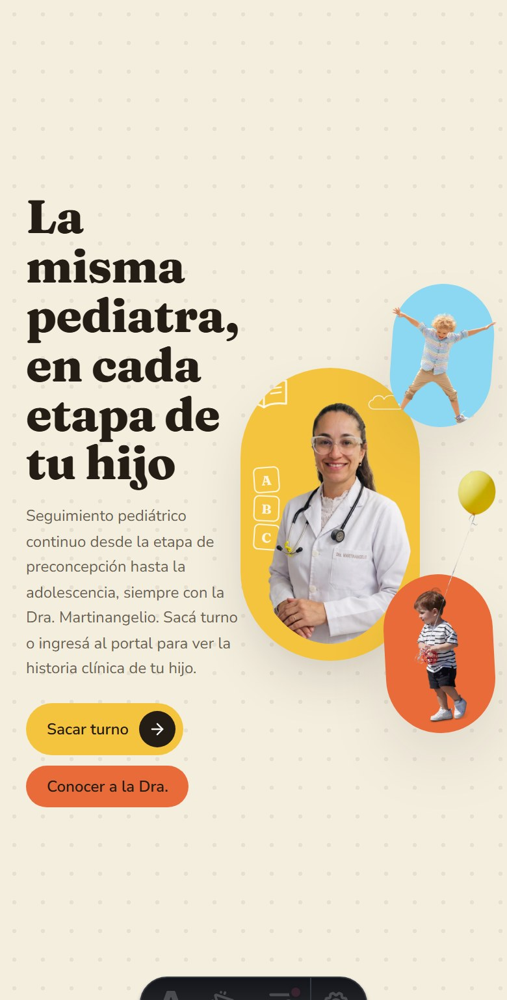     |
| **Acompañamiento** — the five stages of care, from preconception to adolescence: an interactive fan on desktop, a snap carousel on mobile. |    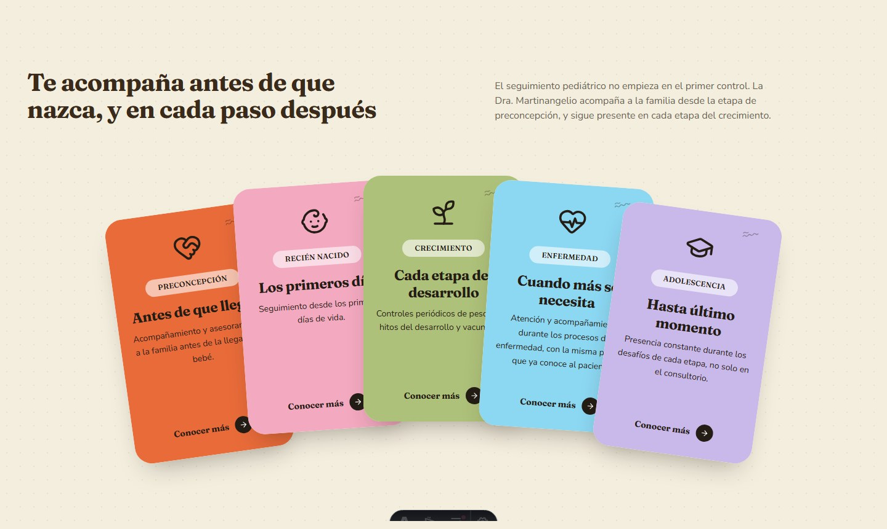    |    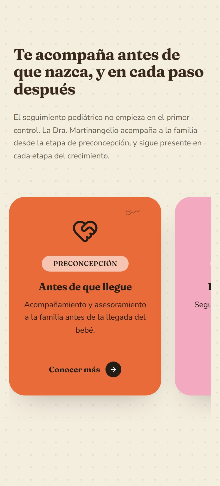    |
| **Testimonios** — real families, real photos, with the practice's track record up top.                                                     | 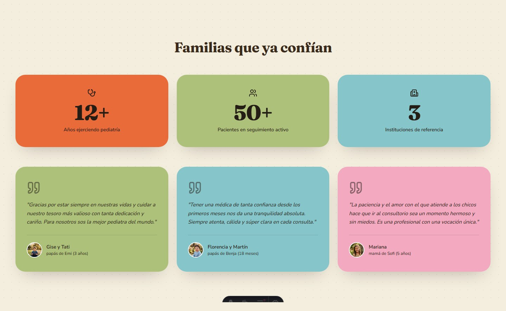 | 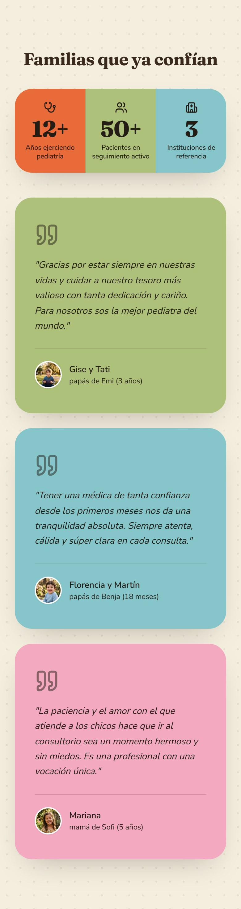 |
| **Turnos** — the closing call to action, pointing every visitor to the patient portal.                                                     |    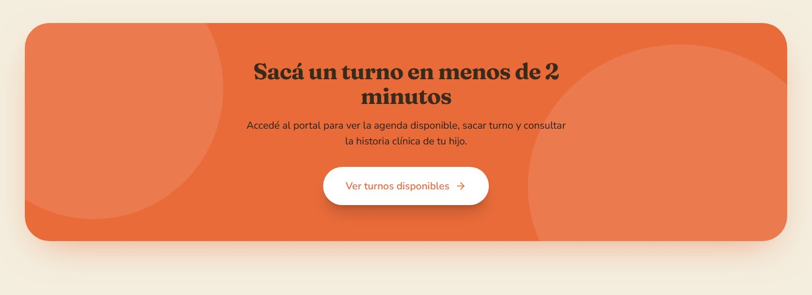    |    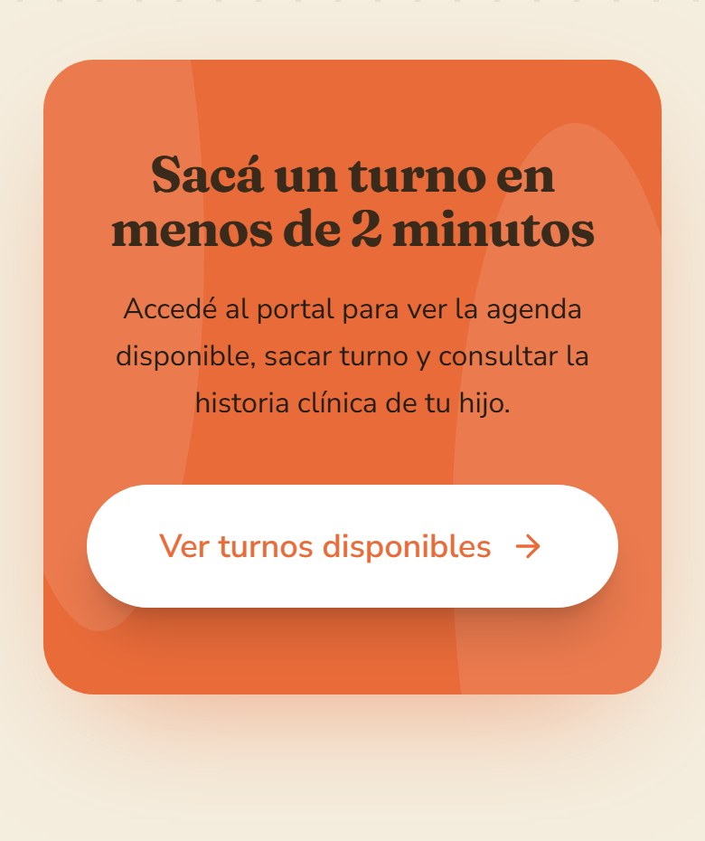    |

### ERP — staff & patient portal (desktop)

**Dashboard** — the day's operation: live metrics, today's bookings and the portal requests inbox.

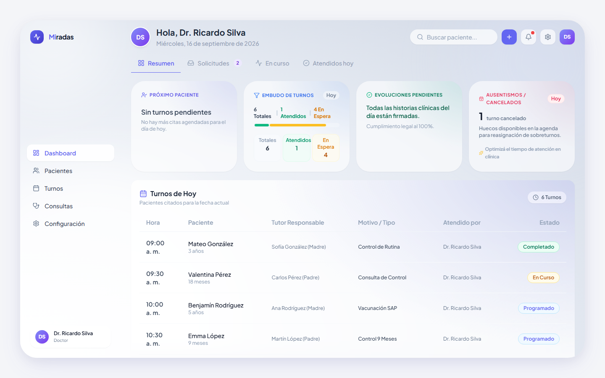

**Portal requests** — appointments requested by families, waiting for staff confirmation. Confirming turns them into scheduled appointments on the agenda.

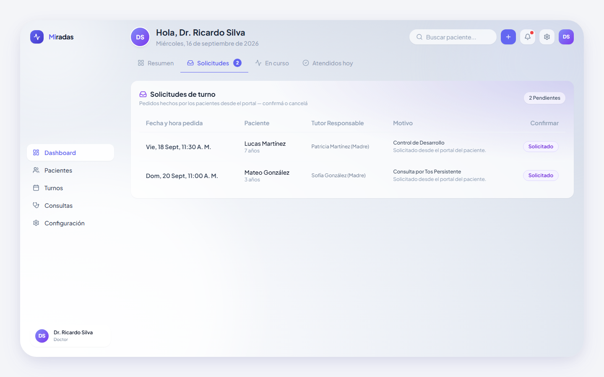

**Agenda** — upcoming appointments with patient, guardian, reason, professional and status.

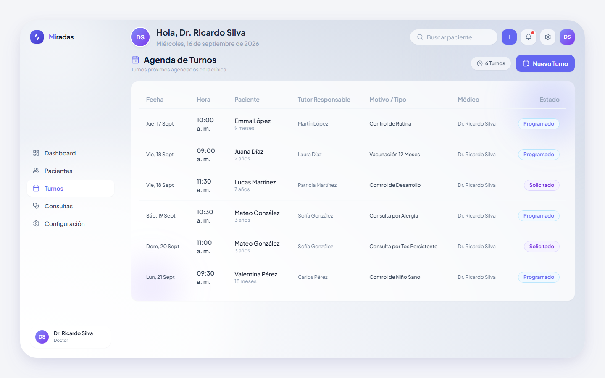

**New appointment** — availability-aware booking: the date and time selectors only offer slots that are actually free.

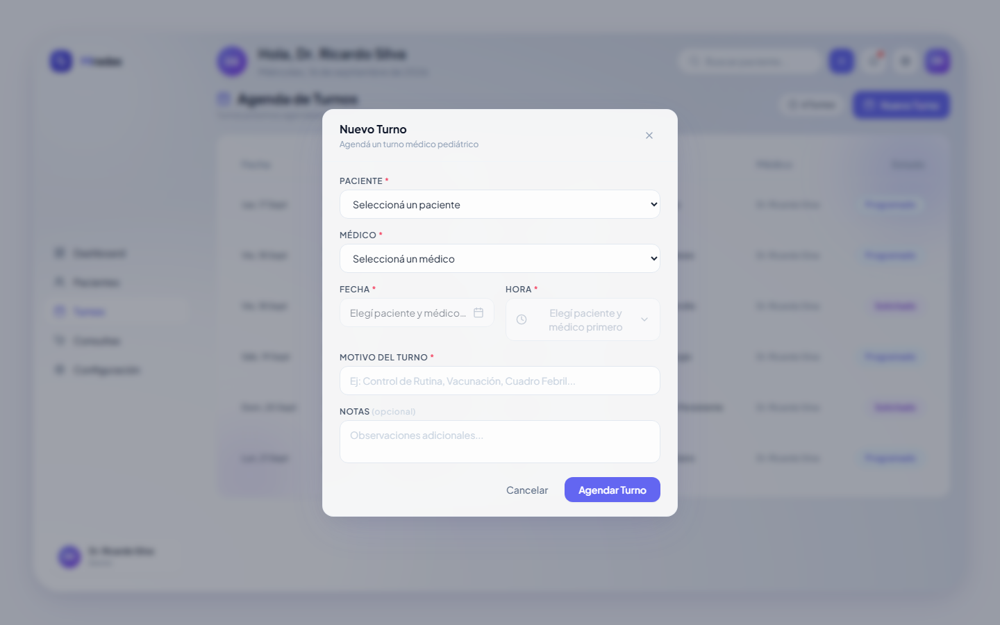

**Consultations** — the daily worklist with the consultation panel embedded: patient context, appointment status, the documentation forms and the latest evolutions, all in one screen.

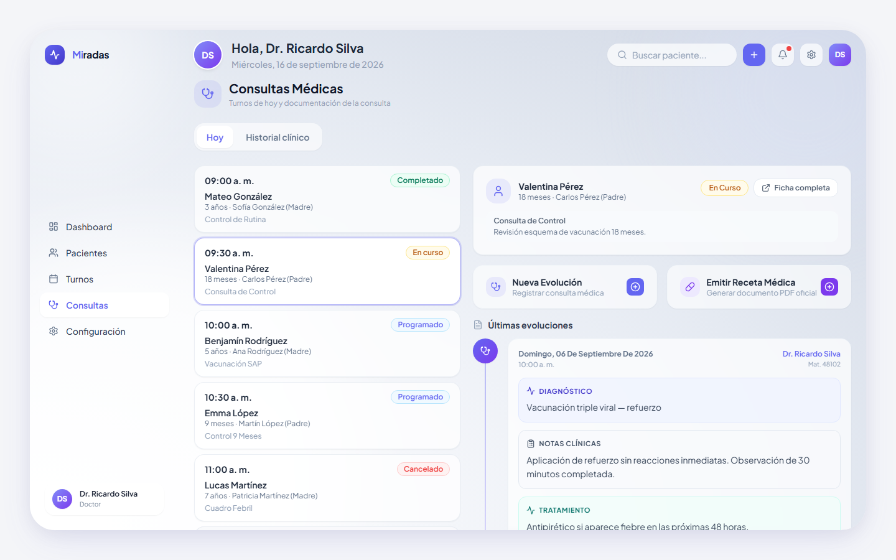

**Patient record** — demographics, perinatal background and coverage next to the clinical history timeline, with evolution and prescription actions.

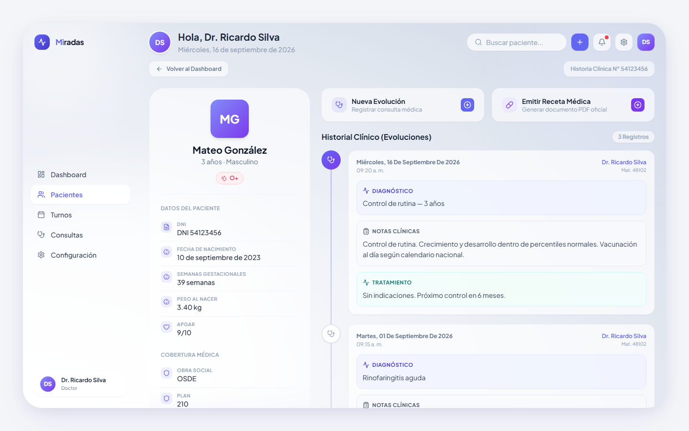

**Patient portal** — families see their next appointment, request new ones and read the clinic's contact details. The exact address is published only behind login.

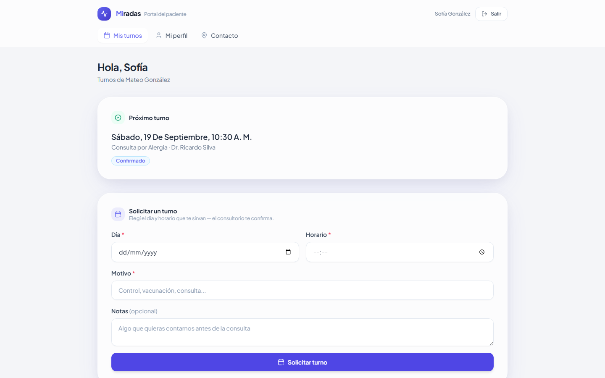

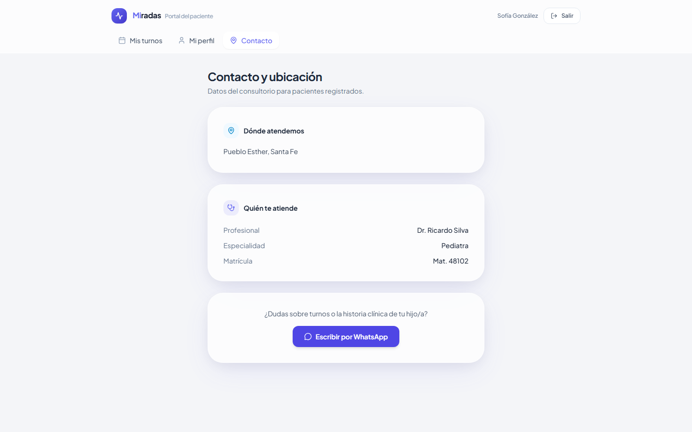

## Core features

- **Role-based access** — SUPER_ADMIN / ADMIN / DOCTOR / SECRETARY / PATIENT enforced by a global JWT guard plus role guards; separate staff and patient experiences.
- **Appointment lifecycle** — `REQUESTED → SCHEDULED → IN_PROGRESS → COMPLETED / CANCELED`, with portal requests confirmed by staff.
- **Clinical records** — immutable evolutions per patient, with perinatal background (birth weight, gestational weeks, Apgar) and health coverage.
- **PDF prescriptions** — issued from the patient record with the professional's data and license.
- **Patient portal** — self-registration, account-to-record linking, appointment requests, profile and gated clinic contact.
- **Consultations workspace** — daily worklist plus the clinic's global clinical history with search.
- **Staff & clinic management** — admin-only staff creation; clinic profile (name, license, address) that feeds the portal.
- **Audit trail** — append-only log of clinical access and changes.
- **Public landing** — SEO-first Astro site with structured data (`schema.org/Physician`), sitemap, web manifest and self-hosted fonts.

## Under the hood

| Layer                | Stack                                                                                                                                                                   |
| -------------------- | ----------------------------------------------------------------------------------------------------------------------------------------------------------------------- |
| API                  | NestJS 10 + Fastify 4 + Prisma 6 + Zod (`nestjs-zod`) + Pino + Swagger · PDFKit for prescriptions                                                                       |
| Web (staff + portal) | Next.js 14 App Router + Tailwind + Radix + React Hook Form/Zod · a BFF proxy keeps the JWT in an httpOnly cookie (never `localStorage`)                                 |
| Landing              | Astro 5 + React islands (zero JS by default) + `schema.org/Physician` + sitemap                                                                                         |
| Data                 | PostgreSQL 16 (Docker for local development) → Neon in production · Prisma migrations + destructive dev seed                                                            |
| Monorepo             | Turborepo + pnpm workspaces: `apps/api`, `apps/web`, `apps/landing`, `packages/db`, `packages/schemas`, `packages/eslint-config`                                        |
| Deploy               | API on Render (multi-stage Docker image; `prisma migrate deploy` runs on boot), web and landing on Vercel, daily `pg_dump → Cloudflare R2` backup workflow (Law 25.326) |
| Tests                | Vitest unit tests on the API (34) + Playwright e2e for authentication and the critical patient → appointment flow                                                       |

## Running it locally

Requirements: Node ≥ 22.12, pnpm 9 (`corepack enable`) and Docker Desktop for the local database.

```bash
# 1. Dependencies
pnpm install

# 2. Environment files
cp apps/api/.env.example apps/api/.env
cp apps/web/.env.example apps/web/.env
cp apps/landing/.env.example apps/landing/.env.local

# 3. Database (PostgreSQL 16 via Docker)
docker compose up -d postgres

# 4. Prisma: generate the client and apply migrations
pnpm --filter @pediatric-erp/db db:generate
pnpm --filter @pediatric-erp/db db:migrate:deploy

# 5. Seed demo data (destructive; refuses to run with NODE_ENV=production)
pnpm --filter @pediatric-erp/db db:seed

# 6. Start everything (turbo: api + web + landing)
pnpm dev
```

| Service                      | URL                                                                |
| ---------------------------- | ------------------------------------------------------------------ |
| API                          | http://localhost:3001/api/v1 (Swagger at `/api/v1/docs`, dev only) |
| Web (staff + patient portal) | http://localhost:3000                                              |
| Landing                      | http://localhost:4321                                              |

Seed accounts (dev-only password `admin123` — override it with the `SEED_PASSWORD` env var):

| Role                               | Email                             |
| ---------------------------------- | --------------------------------- |
| SUPER_ADMIN                        | `admin@admin.com`                 |
| DOCTOR                             | `ricardo.silva@pediatric-erp.com` |
| PATIENT (linked to Mateo González) | `sofia.gonzalez@example.com`      |

Optional: `docker compose --profile tools up -d` adds Adminer at http://localhost:8080.

Root scripts (turbo runs them across every package): `pnpm build`, `pnpm lint`, `pnpm type-check`, `pnpm format:check`, `pnpm clean`.

### Tests

```bash
pnpm --filter @pediatric-erp/api test            # Vitest unit tests
pnpm --filter @pediatric-erp/web test:e2e:install # one-time: Chromium for Playwright
pnpm --filter @pediatric-erp/web test:e2e         # e2e: auth + critical flow
```
